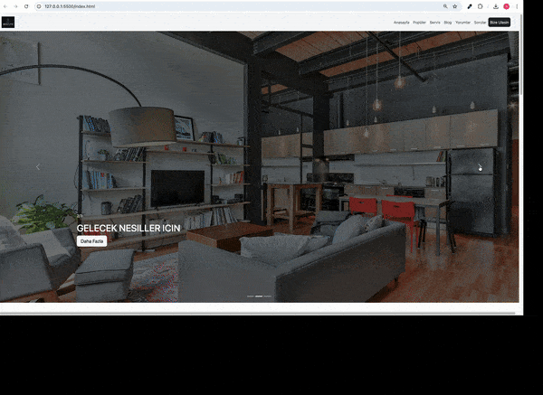

# 🏢 Emaartech Project

A responsive real estate website built using HTML, CSS and Bootstrap 5.

---

## 🎬 Project Preview

---

## 🚀 Features

- Responsive design for all screen sizes
- Bootstrap 5 grid system
- FAQ accordion section
- Card components for team and testimonials
- Modern footer layout
- Clean and structured UI

---

## 🛠️ Technologies Used

- HTML5
- CSS3
- Bootstrap 5

---

## 📌 Project Purpose

This project was created to practice responsive web design and Bootstrap layout systems as part of my full-stack development training.
